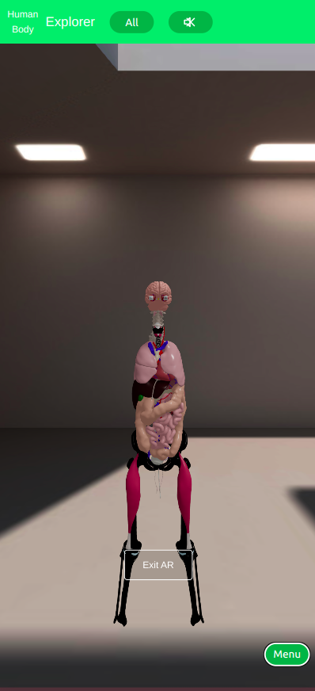
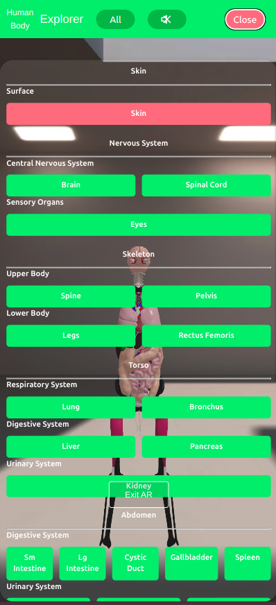
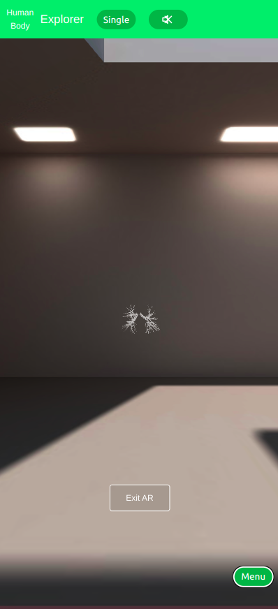
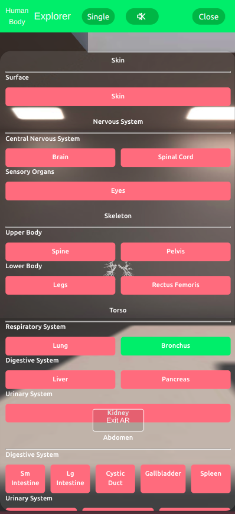

# Projet RAUG - Human Body Explorer

## Description du Projet
Le **Human Body Explorer** est une application interactive en 3D qui permet aux utilisateurs d'explorer le corps humain et ses organes. En utilisant des modèles 3D, les utilisateurs peuvent survoler le corps pour voir les différents organes et cliquer sur chacun d'eux pour obtenir plus d'informations.

## Tester l'Application en Ligne

[Human Body Explorer](https://heldeee.github.io/projet-raug-xr/)

## Mode d'Emploi
1. **Clonez le dépôt** :
   ```bash
   git clone https://github.com/Heldeee/projet-raug-xr.git
   ```

2. **Naviguez dans le dossier du projet** :
    ```bash
    cd projet-raug-xr
    ```

3. **Installez les dépendances** :
    ```bash
    npm install
    ```

4. **Lancez l'application** :
    ```bash
    npm start
    ```

## But
L'objectif de ce projet est de créer une expérience éducative et interactive pour les utilisateurs, les aidant à mieux comprendre la anatomie humaine à travers des visualisations 3D.

## Fonctionnalités Principales

### 1. Visualisation 3D Interactive
- Modèle 3D détaillé du corps humain
- Rotation et zoom libre du modèle
- Visualisation en réalité augmentée (AR) via WebXR
- Illumination dynamique pour une meilleure visibilité

### 2. Navigation et Contrôle
- Menu latéral intuitif pour accéder aux différents systèmes du corps
- Mode de visualisation "Libre" ou "Unique"
  - Mode Libre : Activation/désactivation multiple d'organes
  - Mode Unique : Focus sur un seul organe à la fois
- Interface responsive adaptée mobile/desktop

### 3. Systèmes Anatomiques Explorables
- Système nerveux (cerveau, moelle épinière)
- Système squelettique
- Système digestif
- Système respiratoire
- Système urinaire
- Système reproducteur
- Système vasculaire
- Peau et tissus externes

### 4. Expérience Multimédia
- Fond sonore d'ambiance activable/désactivable
- Animations de personnages dansants
- Affichage des noms d'organes au survol
- Support multilingue (Français/Anglais)

### 5. Fonctionnalités Techniques
- Application Web Progressive (PWA)
- Support de la réalité augmentée
- Responsive design
- Performance optimisée pour web mobile
- Déploiement continu sur GitHub Pages

## Visualisation

### Mode All
<table>
  <tr>
    <td width="50%">
      
      <p align="center">Sans menu</p>
    </td>
    <td width="50%">
      
      <p align="center">Avec menu</p>
    </td>
  </tr>
</table>

### Mode Single
<table>
  <tr>
    <td width="50%">
      
      <p align="center">Sans menu</p>
    </td>
    <td width="50%">
      
      <p align="center">Avec menu</p>
    </td>
  </tr>
</table>

## Feature Surprise 🎵
Explorez l'anatomie humaine en rythme ! Des danseurs virtuels se cachent dans votre découverte, ajoutant une touche de divertissement à votre expérience d'apprentissage. Allez-vous les trouver ?! 💃🕺

## Membre du groupe

- leo.devin
- phu-hung.dang

### Repartitions des rôles

- leo.devin:
    - Création de la structure de l'application
    - UX/UI Design
    - Menu de navigation
    - Deploiement de l'application sur GitHub Pages
    - Documentation
    - Animation des personnages dancant
    - Adaptation WebXR

- phu-hung.dang:
    - Recherche et intégration des modèles 3D
    - Implémentation de la logique de l'application
    - Documentation
    - Sound Design


## Sources d'Inspiration
- Documentation officielle de [THREE.js](https://threejs.org/docs/index.html#manual/en/introduction/Introduction)
- Texture Cube [TextureCube](https://threejs.org/docs/#api/en/textures/CubeTexture)
- TeaPot [TeaPot](https://threejs.org/examples/#webgl_geometry_teapot)
- [Interactive Cubes](https://threejs.org/examples/#webgl_interactive_cubes) 
- Articles et ressources sur l'anatomie humaine
- Wikipedia
- Modeles 3D du corps humain utilisé [3D Reference Object Library](https://humanatlas.io/3d-reference-library?version=2.1&organ=Palatine%20Tonsil)
- [Mixamo pour les animations des personnages et la dance](https://www.mixamo.com/)

## License

Ce projet est sous licence MIT - voir le fichier LICENSE
